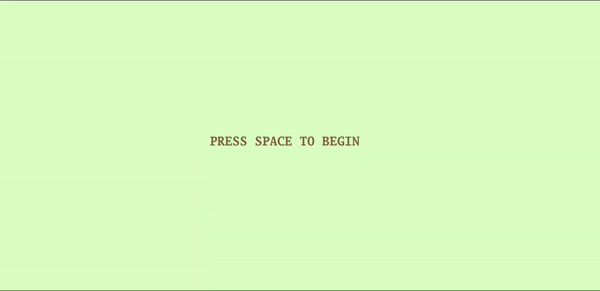

## A simple ping pong like game

A simple two player game, written in [Go](https://go.dev/), using [Ebitengine](https://ebiten.org/) _a dead simple 2D game library for Go_.

Intention to write this was to get an overview, before implementing in [Jack](https://drive.google.com/file/d/1rbHGZV8AK4UalmdJyivgt0fpPiD1Q6Vk/view) [here](https://github.com/ishwar00/NandToTetris/tree/main/nand2tetris/projects/09). 



### How to play
So to play, it requires two players, _left player_ and _right player_. For _left player_ pressing `w` will move left block __up__, pressing `s` __down__.

For _right player_ pressing up arrow key `↑` will go __up__, pressing down arrow key `↓` __down__


### How to play on your local machine
make sure you have installed 
- [Go](https://go.dev/dl/) (i used 1.18.3)
- [ebitengine](https://ebiten.org/documents/install.html)

Run the following commands

```
git clone https://github.com/ishwar00/simple-ping-pong-game.git
cd simple-ping-pong-game/src
```
Don't forget to [set GOPATH](https://github.com/golang/go/wiki/SettingGOPATH).

To compile source to binary into `$GOPATH/bin` folder.
``` 
go install
```

Finally run the command to launch the game.
```
../bin/simple-ping-pong-game
```

